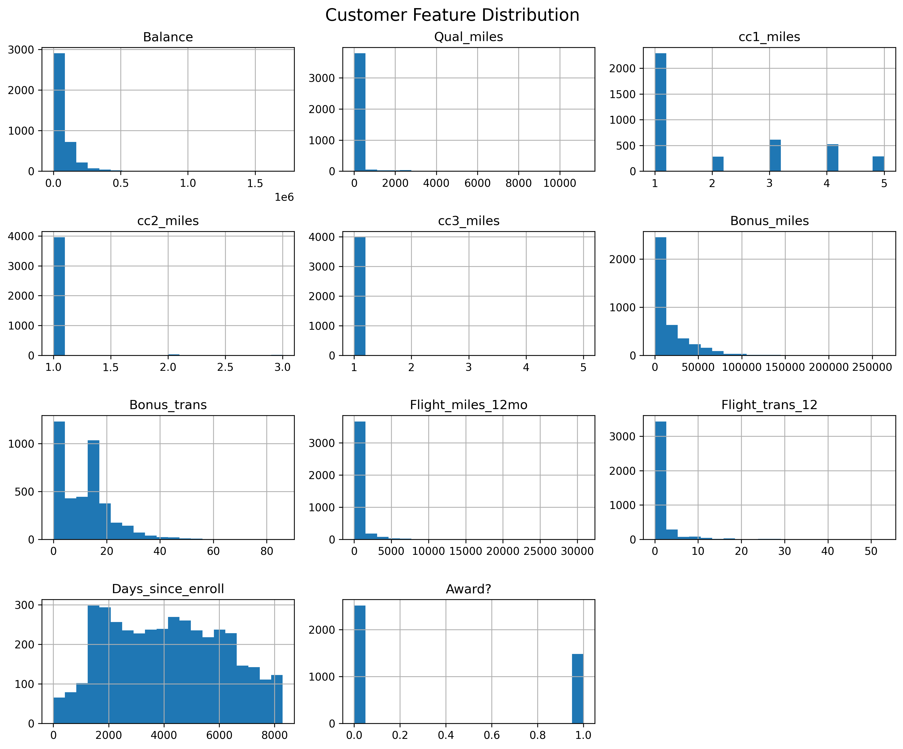
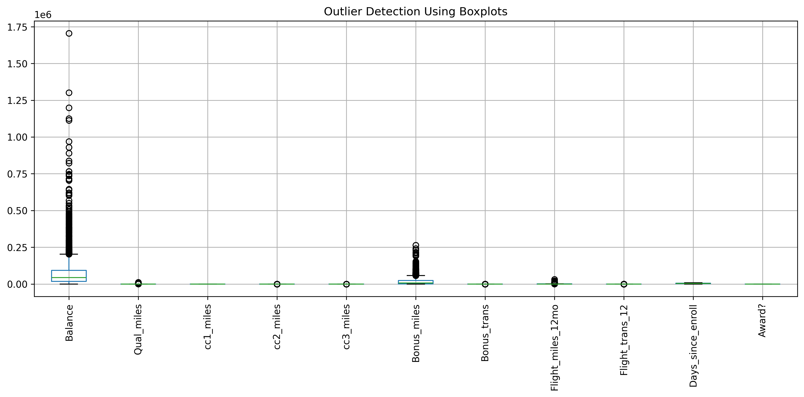
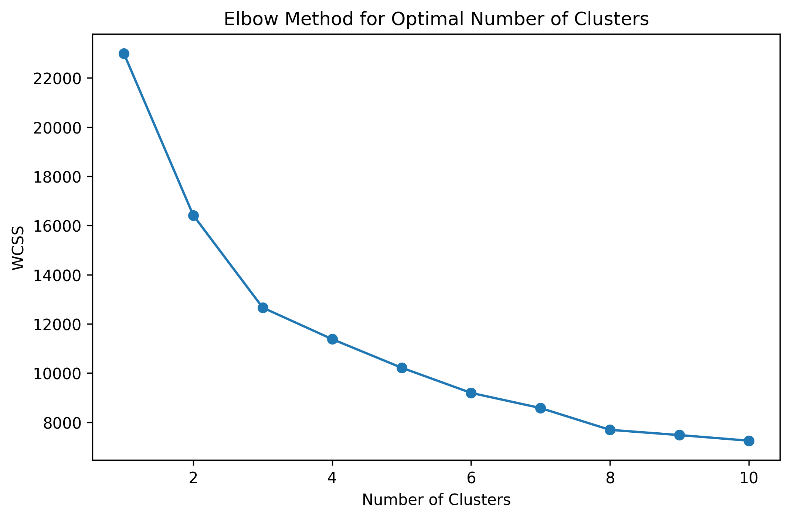
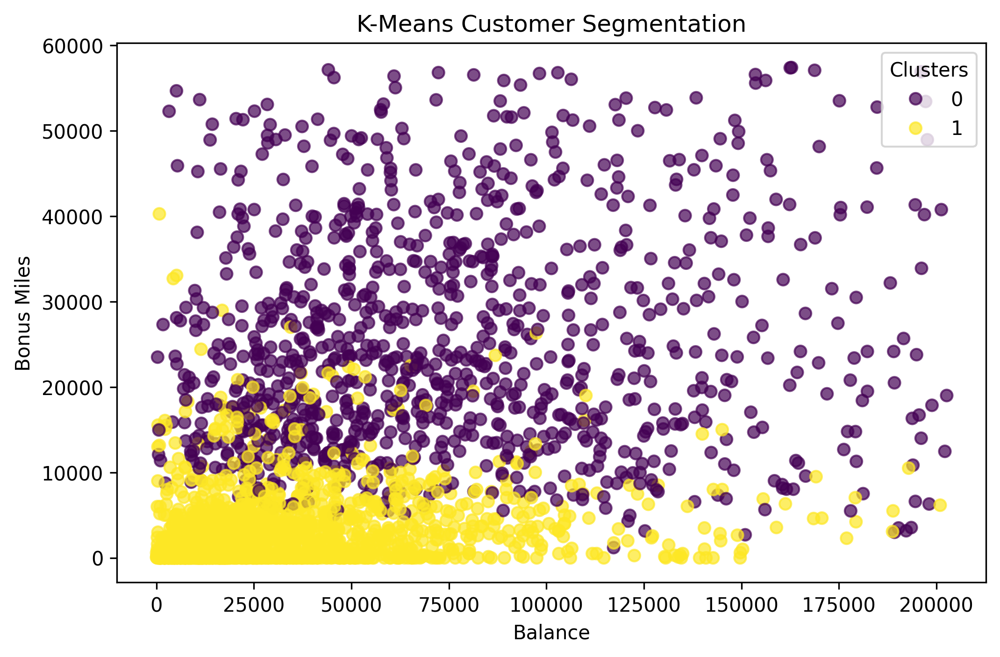
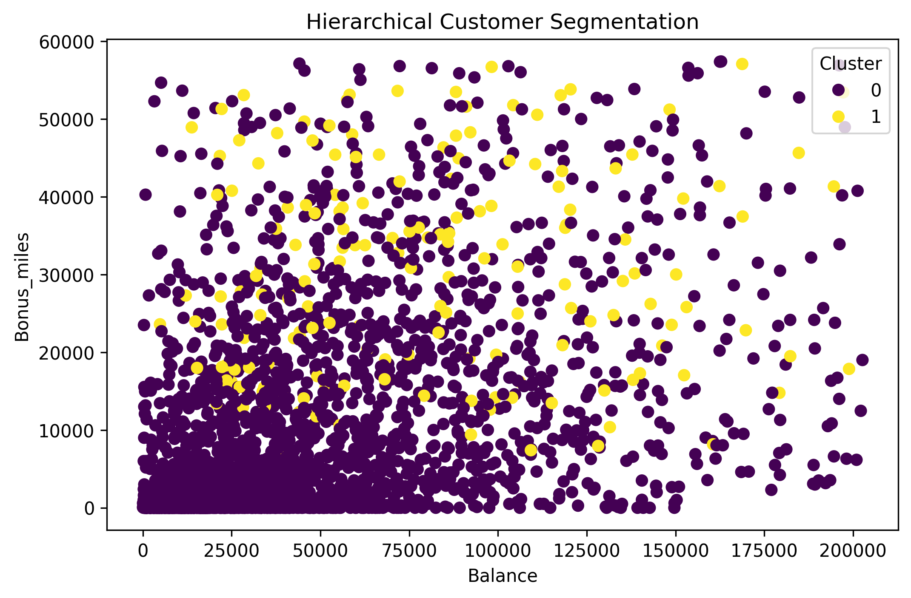
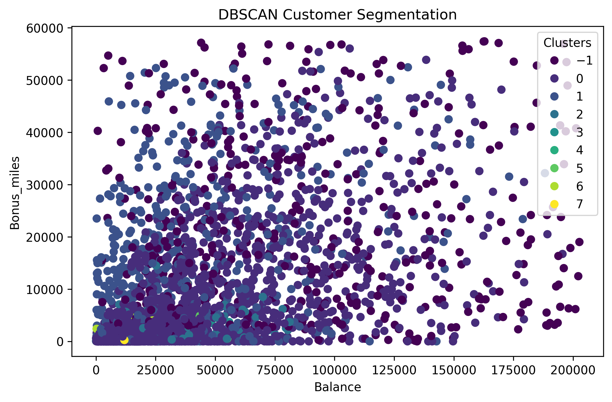

# 📊 Customer Segmentation using Unsupervised Machine Learning

This project applies multiple unsupervised machine learning techniques to segment customers based on behavioral and transactional data. The goal is to identify meaningful customer groups for targeted marketing and business insights.

---

## 🚀 Project Overview

Customer segmentation is performed using:

- K-Means Clustering
- Hierarchical Clustering
- DBSCAN

The dataset contains airline customer information such as balance, miles, transactions, and enrollment details.

---

## 🗂️ Repository Structure
Customer-Segmentation-using-Unsupervised-Machine-Learning/                                          
│                                                                                                   
├── dataset/                                                                                        
│ └── EastWestAirlines.xlsx                                                                         
│                                                                                                   
├── images/                                                                                         
│ ├── elbow_method.png                                                                              
│ ├── kmeans_clustering.png                                                                         
│ ├── hierarchical_clustering.png                                                                   
│ ├── dbscan_clustering.png                                                                         
│ ├── customer_feature_distribution.png                                                             
│ └── outlier_detection_boxplot.png                                                                 
│                                                                                                   
├── notebooks/                                                                                      
│ └── eastwest_airlines_customer_segmentation.ipynb                                                 
│                                                                                                   
├── README.m                                                                                        
└── requirements.txt                                                                                

---


---

## 📊 Data Preprocessing

- Handled missing values
- Removed low variance features
- Feature scaling using StandardScaler
- Outlier detection using boxplots

---

## 📈 Exploratory Data Analysis

### Feature Distribution


### Outlier Detection


---

## 🤖 Model Implementation

### 🔹 K-Means Clustering

- Optimal clusters identified using Elbow Method





---

### 🔹 Hierarchical Clustering

- Dendrogram used to determine cluster structure



---

### 🔹 DBSCAN

- Density-based clustering for noise detection



---

## 📊 Results & Insights

- K-Means provided interpretable clusters but moderate separation
- Hierarchical clustering performed well for structured grouping
- DBSCAN struggled due to dataset density distribution
- Silhouette score observed was relatively low (~0.36), indicating overlapping clusters

---

## 🛠️ Technologies Used

- Python
- Pandas
- NumPy
- Matplotlib
- Seaborn
- Scikit-learn
- SciPy

---

## ⚙️ Installation

```bash
git clone https://github.com/your-username/Customer-Segmentation-using-Unsupervised-Machine-Learning.git
cd Customer-Segmentation-using-Unsupervised-Machine-Learning
pip install -r requirements.txt
